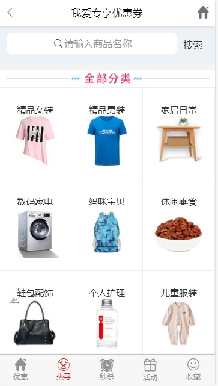

# express搭建的淘宝客网站
>测试地址: www.5aiss.com
>项目地：https://gitee.com/null_639_7345/taobaoke

## 效果




## 1.运行

* 安装mongodb数据库
* 修改配置文件config/default.js
* 配置淘宝api信息
\taobaoke\server\tbk\TbkAPI.js
```js
var client = new TopClient({
  appkey: "***",//你的appkey
  appsecret: "***",//appsecret
  REST_URL: "http://gw.api.taobao.com/router/rest"
});

let api = (module.exports = {
  adzone_id: "***",//你的adzone_id
  fields:'num_iid,title,pict_url,small_images,reserve_price,zk_final_price,user_type,provcity,item_url'
});

```
>不清楚的请参考-book/淘宝客API使用方法.doc
* 安装依赖库
```sh
npm i gulp -g
npm i
```
* 前端打包
```sh
gulp
```
* 启动web服务
```sh
node ./bin/www
```


